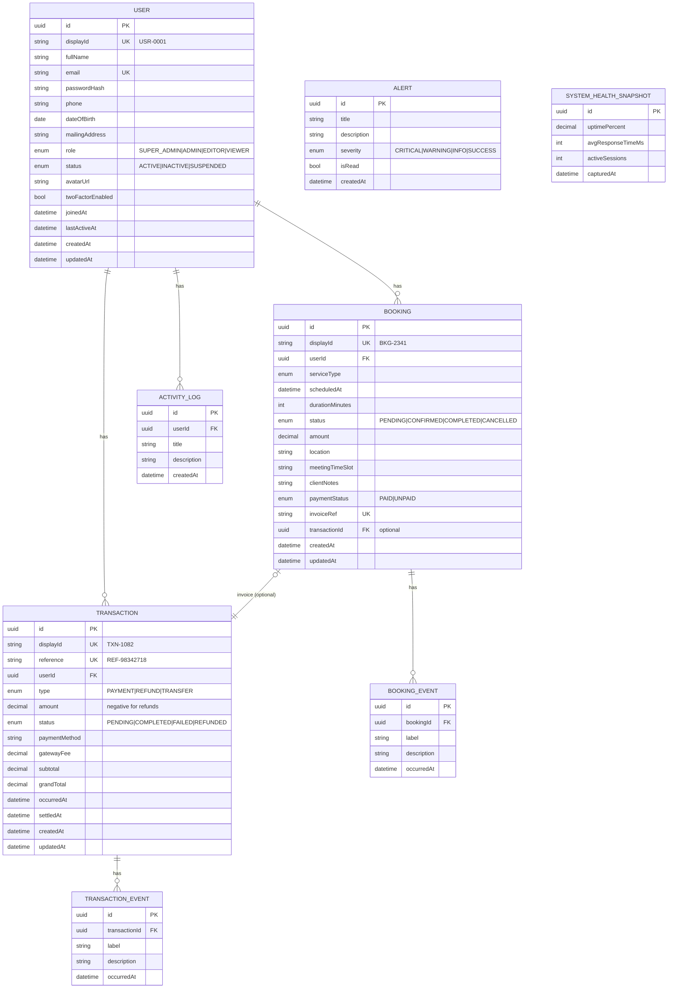

# AdminHub — ER / Data Model

## Relationships
- **User → Transaction** (1:N, cascade delete)
- **User → Booking** (1:N, cascade delete)
- **User → ActivityLog** (1:N, cascade delete)
- **Transaction → TransactionEvent** (1:N, cascade delete)
- **Booking → BookingEvent** (1:N, cascade delete)
- **Booking → Transaction** (optional 1:1 invoice link, `SetNull` on delete)
- **Alert**, **SystemHealthSnapshot** — standalone

## Indexes
Indexed columns match the UI's search / filter / sort needs:
- `User`: role, status, joinedAt, fullName, email
- `Transaction`: userId, status, type, occurredAt, amount
- `Booking`: userId, status, serviceType, scheduledAt, paymentStatus
- Event/log tables: foreign keys + createdAt
