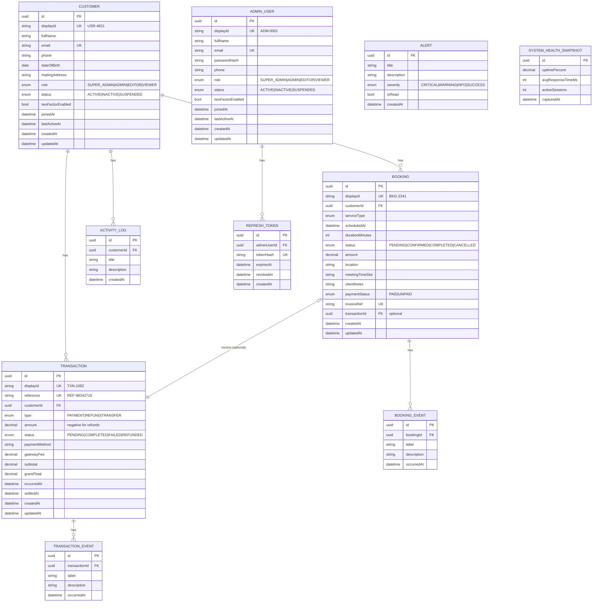

# AdminHub — ER / Data Model

Two distinct populations:
- **AdminUser** — operators of the admin portal (authenticate here, have roles).
- **Customer** — end-users of the public website (subjects of transactions/bookings),
  managed/viewed from the admin portal. No admin-portal login.

## Relationships
- **AdminUser → RefreshToken** (1:N, cascade) — only admins log into the portal.
- **Customer → Transaction / Booking / ActivityLog** (1:N, cascade).
- **Transaction → TransactionEvent**, **Booking → BookingEvent** (1:N, cascade).
- **Booking → Transaction** (optional 1:1 invoice link, `SetNull`).
- **Alert**, **SystemHealthSnapshot** — standalone.

## Why two tables (AdminUser vs Customer)
This API powers the **admin portal**; a separate **customer portal/website** serves
end-users. The two populations are disjoint: admins authenticate and manage; customers
transact and book. Splitting keeps FKs unambiguous (`transactions.customerId` always
points to a `Customer`), isolates admin credentials from customer data, and lets the
`Customer` table be reused by the future customer portal. Dashboard "Total Users" counts
customers.

## Indexes
- `AdminUser`: role, status, joinedAt, fullName, email
- `Customer`: role, status, joinedAt, fullName, email
- `Transaction`: customerId, status, type, occurredAt, amount
- `Booking`: customerId, status, serviceType, scheduledAt, paymentStatus
- Event/log/token tables: foreign keys + createdAt
